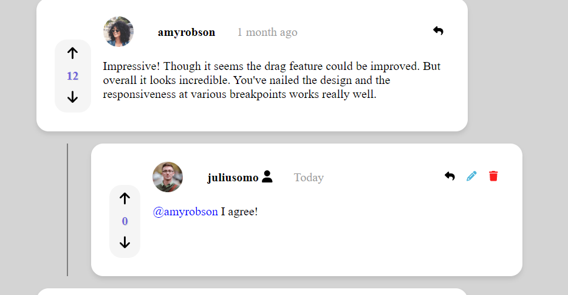

# Interactive Comment Component Frontend

This is the frontend for the Interactive Comment Component project from frontend mentor. This project provides a full-stack CRUD (Create, Read, Update, Delete) functionality for managing comments.

https://interactive-comment-component.netlify.app

## Table of Contents

- [Introduction](#introduction)
- [Technologies Used](#technologies-used)
- [Features](#features)
- [Cool Features and Implementation Details](#cool-features-and-implementation-details)
- [API Endpoints](#api-endpoints)
- [Screenshots](#screenshots)
- [Contact](#contact)

## Introduction

This project is a single-page application (SPA) built uing React.js and Node.js. It serves as the frontend for the Interactive Comment Component project from frontend mentor. The application provides a full-stack CRUD functionality for managing comments, allowing users to create, read, update, and delete comments.

## Technologies Used

- Frontend: React, React Hooks, CSS Modules
- Backend: Node.js, Express.js
- Database: JSON file (db.json)
- Libraries: Axios (for HTTP requests), Font Awesome (for icons), UUID (for generating unique IDs)

## Features

1. Commenting System
The core functionality of the app is the ability to create, read, update, and delete comments and replies. This is implemented using a nested data structure in the db.json file, where each comment can have an array of replies, and each reply can have its own array of replies, and so on.
2. Upvoting/Downvoting
Users can upvote or downvote comments and replies. The vote count is maintained in the state of the Comment component and updated accordingly. The upvote/downvote buttons are disabled based on the user's previous vote to prevent multiple votes.
3. Replying to Comments
Users can reply to any comment or reply by clicking the "Reply" button. This toggles the visibility of a reply input field beneath the respective comment/reply. The replies are stored as nested objects within the parent comment's replies array in the db.json file.
4. Editing Comments
Users can edit their own comments by clicking the "Edit" button. This toggles the comment text into an editable textarea, where users can modify the content and save their changes. The updated comment is sent back to the server using a PUT request.
5. Deleting Comments
Users can delete their own comments by clicking the "Delete" button. This opens a confirmation modal to prevent accidental deletions. Upon confirmation, the comment (or reply) is removed from the nested data structure in the db.json file using a recursive function.
6. @Mentions Highlighting
The app includes a helper function (highlightMentions) that scans the comment content for @mentions and wraps them in a  element with a custom CSS class (mention). This allows for easy styling and potential future functionality, such as linking to user profiles.
7. Single Reply Box
To enhance the user experience, only one reply input box is visible at a time. This is achieved by toggling the visibility of the reply input boxes based on the currently selected comment/reply using the closeOtherReplyBoxes helper function.
8. Date Formatting
The app includes a formatDate function that intelligently formats the comment creation date based on its proximity to the current date. For example, if the comment was created today, it displays "Today"; if it was created yesterday, it displays "Yesterday"; within a week, it shows the number of days ago; within a month, it shows the number of weeks ago; and beyond a month, it shows the number of months ago.

## Cool Features and Implementation Details

- Recursive Comment/Reply Traversal: The app employs recursive functions (findCommentById and deleteCommentOrReply) to traverse the nested comment/reply data structure when fetching or deleting a specific comment/reply. This approach allows for efficient handling of deeply nested data structures.
- Reusable Comment Component: The same Comment component is used to render both top-level comments and nested replies, with the isTopLevel prop determining whether to render the reply input box or not. This promotes code reusability and maintainability.
- Conditional Rendering: The app makes extensive use of conditional rendering based on user authentication, comment ownership, and various component states (e.g., edit mode, delete confirmation modal). This ensures that users only see and interact with relevant UI elements based on their permissions and the current state of the application.
- State Management with React Hooks: The app leverages React Hooks, such as useState, to manage component state and handle user interactions like voting, editing, and replying. This promotes a more functional and reusable approach to state management.
- Server-side Data Manipulation: The backend logic for creating, updating, and deleting comments and replies is implemented in the index.js file using Node.js and Express.js. The db.json file acts as a simple JSON-based database, which is read, manipulated, and written back to disk on every relevant operation.
- Error Handling: The app includes basic error handling mechanisms, such as logging errors to the console and displaying appropriate error messages to the user when certain operations fail (e.g., creating an empty reply, deleting a non-existent comment).
- Modular Design: The codebase is organized into separate modules (Comment.jsx, services.js, index.js) for better code organization and maintainability.

## API Endpoints

The backend server provides the following API endpoints:

- `GET /api/comments`: Retrieve all comments.
- `POST /api/comments`: Create a new comment.
- `GET /api/comments/:id`: Retrieve a specific comment by ID.
- `PUT /api/comments/:id`: Update a specific comment by ID.
- `DELETE /api/comments/:id`: Delete a specific comment by ID.

## Screenshots

  
 
  
 
  
 
  
 
  
 
  
 
  
 
  
 
  
 

## Acknowledgements

 - For the project itself [frontendmentor](https://www.frontendmentor.io/challenges/interactive-comments-section-iG1RugEG9)
 - For getting me going on the backend [FullStackOpen](https://fullstackopen.com/en)

## Author

- [@JonesInForCode](https://www.github.com/JonesInForCode)

## 🚀 About Me

My name is Nick Jones (JonesInForCode) - I am a Frontend Developer and Aspiring Full Stack Developer looking to build projects that challenge and teach me.

# Are you Jonesin for some code!? 👋

## 🔗 Links

## Contact

If you have any questions or feedback, please feel free to reach out to me at nico.rjones@outlook.com
